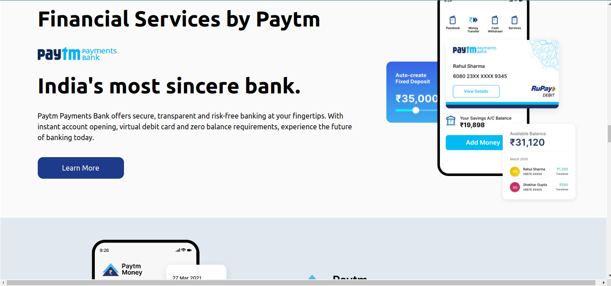

# I am Abhishek Singh
_I am learning Full stack javascript Development_

## This is the assignment that is the part of our live course.

### This is my first Tailwind project

### What I did in this project ?

## Navbar Section
_I made first navbar then the approach of tailwind css is mobile first then desktop so i faced some problem in small screen sizes to fix navbar so i learned how hidden property works on small screen size_
## Chalenging part for me 
_To fix the navbar in small scren sizes._

## Hero Section
_I made hero section with the help of flex and i have given for all container to medium screen size w-1/2 i learned about how width property worked on tailwind css and on small screen size it automatically takes the whole width and for small screen size i used flex poperty that is flex-direction :column and learned some more concept how items will be in center and items will be space between them_.

## Section -1
_In this sction i used grid to make the all cards and learned how gird property works. In medium screen size i have taken 6 cards and on small screen sizes i have taken only two card in a row so i learned that how this property will work on medium screen size and small scree size._
## Chalenging part for me 
_To fix the card in small screen size._

## Section -2
_This container should be in center i learned that how margin auto works in all screen sizes and so i redueced the width and i gave the class property that is mx-auto._

## Footer -Section
_This footer section i made using grid._


# This is totally  Responsive in all screen sizes.
# Tailwind Project
1. Paytm Clone

# Technology used:
1. ```HTML5```
1. ```Tailwind CSS```

# Deployed Link
[Netlify Link](https://paytm-clone-apps.netlify.app/)





# Time Taken To Complete This project

_12hours_
